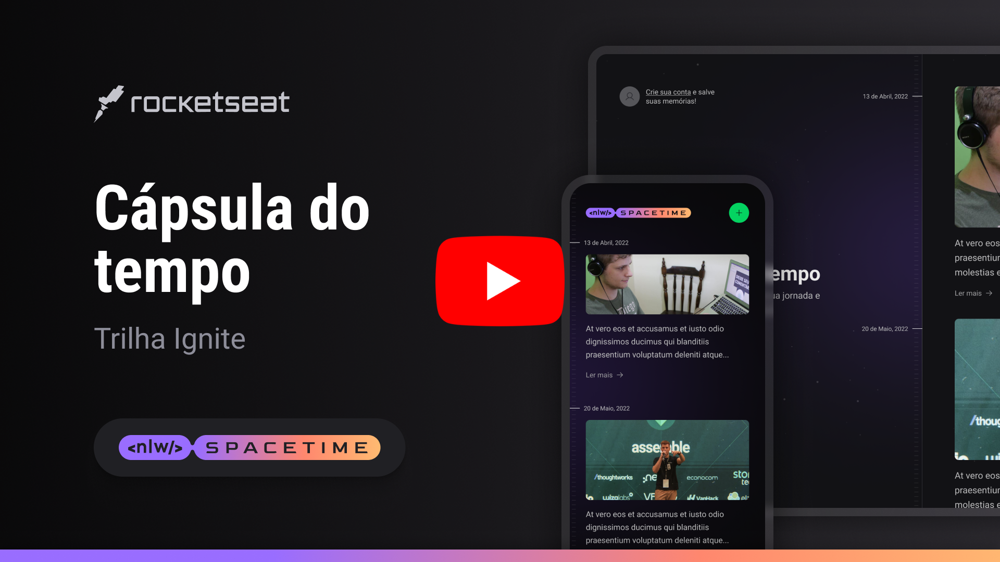

  

 

  

   

  <a>
    
    
    
    
    
    
    
  <a/>

 

## Project description

Time capsule application, where the user can add texts, photos and videos of important events in his life to a timeline, organized by month and year.

> `<nlw/> Spacetime` is a project developed during the **Next Level Week**, online event produced by [**Rocketseat**](https://www.rocketseat.com.br/).

## License

This project is registered under the MIT license.

---

Made with ❤️ by Renan Gabriel
